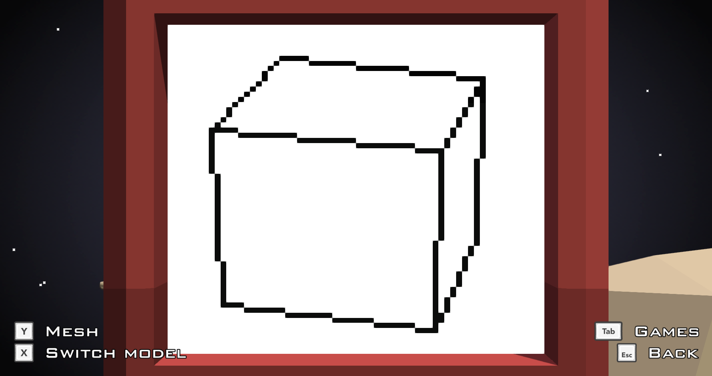

# Platonic solids- 3D demo
A simple 3D rendering of demonstrated on 5 platonic solids.

## Platonic solids
[Platonic solid](https://en.wikipedia.org/wiki/Platonic_solid) is a three dimensional solid whose faces are congruent regular polygons. In addition the same number of faces must meet at each vertex.  
It's not very hard to see, that exactly 5 of such solids exist, and the look like this.


## 3D rendering
In 3D graphics, each object is represented as a set of polygons/faces. Each polygon is list of pointers to the list of all vertices in the object.  
The main task in 3D rendering is to convert the 3D coordinates to the 2D coordinates of our screen. When have this mapping, we can map all the vertices and then just draw a bunch of line segments representing the edges and we obtain a mesh render.
So the question is how the heck do we do that?

To display a 3D scene on a screen, you need something called a camera. Such a camera is defined by its position and rotation in space.  
You also need some linear algebra, but common if you don't know linear algebra, then what are you even doing with your life?

### Perspective divide
Suppose now, that the camera position is *(0,0,0)* and that it is facing the z direction (and that it is flat - not tilted or anything).  
In this settings, how do we convert any *(x,y,z)* point in space to the view of the camera?  
We simple map  
(x,y,z) --> (x/z, y/z)

### General camera - Camera Coordinate System
To avoid dealing with nonlinear (affine) transformations, we still want the position of the camera to be *(0,0,0)*. This is very easy to achieve. We just translate everything so that the camera is in the origin. We then deal with the rotation in a similar manner. We need to somehow rotate the world so that the camera faces the direction we want. At first glance this might look like a little harder problem. But not until we realise, that since we don't need to deal with translation this transformation is linear. What matrix corresponds to this transform? Camera's orientation corresponds to a bases (ortonormal, unless you are doing some weird artistic sh*t) of the 3D space. These basic vectors when put side by side form a matrix of transforming coordinates in the camera basis to the world coordinates. We need to go the other way, hence, we need to invert that matrix.

### Everything is a matrix
As we know, translation is affine (not linear!!!) transformation, so it cannot be represented by a matrix. Or can it? We can represent translations of 3D space by embedding it in 4D space. In 3D graphics practice, everything is represented using 4×4 matrices. As you can imagine that aproach has many advantages.

For more detailed explanation and pictures, check out [this article](https://www.scratchapixel.com/lessons/3d-basic-rendering/computing-pixel-coordinates-of-3d-point/mathematics-computing-2d-coordinates-of-3d-points).

### Our simplified case
I felt like implementing matrix multiplication and a complete 3D transformation engine would be an overkill. Our camera has only two degrees of freedom (called yaw, pitch) instead of 6 and so I dealt with the rotations individually instead of creating the rotation matrix. At this point I would like to just point out that simple transformations like rotation along one axis are trivial to invert (its in fact rotating in the opposite direction).  
What I do is I rotate the model and then I move away from the center along the z direction. The code responsible for this 3D -> 2D transformation is
```
function toScreen(point)
	x = point[1];	y = point[2];	z = point[3]
	--Rotations:
	cosB = math.cos(yaw); sinB = math.sin(yaw)
	xx = x
	x = cosB * x - sinB * z
	z = sinB * xx + cosB * z
	cosA = math.cos(pitch); sinA = math.sin(pitch)
	yy = y
	y = cosA * y - sinA * z
	z = sinA * yy + cosA * z
	
	--Translation + projection	
	z = z + 14
	x = x/z
	y = y/z
	x = 32 + 256*x
	y = 32 - 256*y
	return {x,y,z}
end
```
The last couple lines are there to scale the output correctly to the 64×64 screen.

### Visibility problem
With converting coordinates from one basis to another and with perspective divide, we know how to map any 3D point in the scene to the 2D point on screen. But to draw a real picture we cannot just draw everything on top of other stuff. Some parts of the scene lie in front of others, blocking the view.
It turns out, this is a kind of difficult problem.  
Well, you say, we can just sort the polygons according to the distance from camera and the draw them in that order. Wrong. There exist setups of polygons where no such order exists (1 is blocking 2, 2 is blocking 3 and 3 is blocking 1). When you try to solve this (by cutting the polygons to resolve such problems) you qucikly enter a rabbit hole.  
Common approches to this (rasterisation or ray tracing) work by considering each individual pixel separately and are two heavy for our application.

In the end I used the fact that our models are not just any kind of objects to my advantage.

For any convex object, any line intersecting the object is intersecting it at exactly 2 points (unless it's 1 - not interesting). Point is exactly two points on the edge of the object map two the same pixel on the screen. Thus, we just need to figure out, which of the faces containing the two points is the "front" one and which is the "back" one.

### Normals
Each polygon in 3D has something called a normal. It's a vector ortogonal to the polygon (that is to all its edges). We can calculate it by taking a vector product of the first and the second edge of the polygon. Note, that vector product is anticommutative, meaning that if we define the vertices of the polygon in the reversed order, the normal would point the opposite direction. We can use this fact to determine, which direction a face is facing. We just need to make sure, that when we list the vertices of a polygon we always list them in clockwise (or anticlockwise) direction, looking at the outer side of it.

So, after converting the model to camera coordinates, we can calculate the normal and according to wheter the *z* coordinate is negative or positive, we can tell wheter we are looking at the face from the back or front. But we can even simplify this. Note that the *z* coordinate of the vector product of the edges (as 3D vectora) is equal to dot product of one edge (as 2D vector) and a ortogonal vector to the other edge (as 2D). This makes perfect sense - when we are checking wheter this number is negative or positive, we are checking wheter the angle of the polygon edge (on screen!!) is negative or positive - that is whether the vertices go in the CW or CCW direction. If they go in CW direction, we know we are looking at the front side of the polygon - because that's how we set it up in the first place. 

## Redirection robot arcade
Robot comprises 64×64 B/W screen, 4 directional joystick and two buttons. Arcade are programmed in Lua. In game the screen might look something like this
  
In this arcade, arrows can be used to rotate the camera around the model and the buttons can be used to switch between the 5 models or to toggle mesh view.  
If you are interested, check it on [Steam workshop](https://steamcommunity.com/sharedfiles/filedetails/?id=2048001468).
